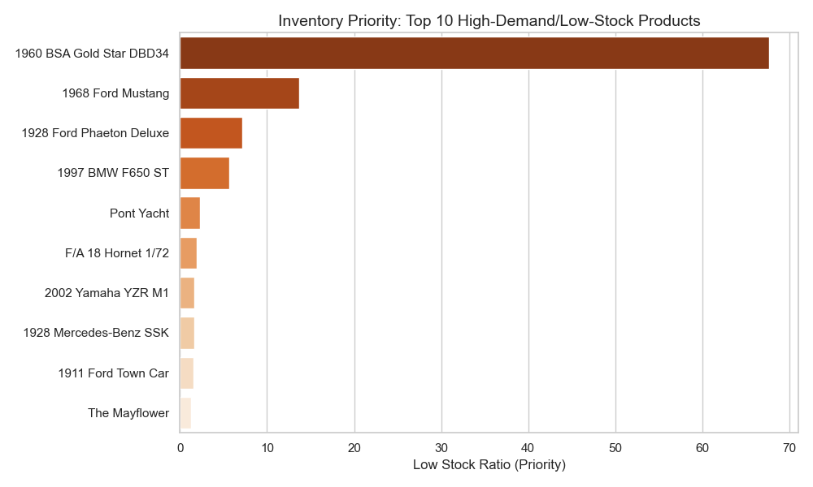
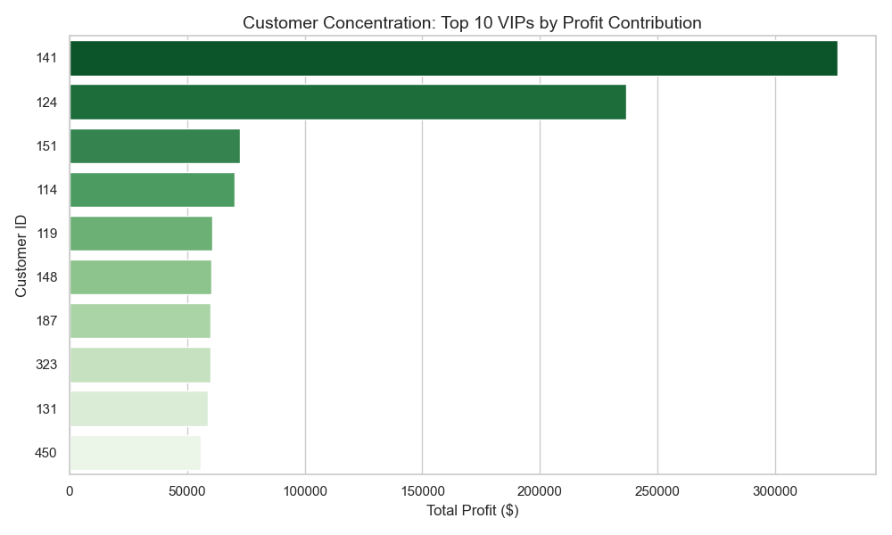

# Sales Intelligence Analysis for Scale Model Cars

## Project Overview
This project implements an automated data pipeline to analyze sales performance, inventory health, and customer lifetime value (LTV) for a global scale-model car distributor. By integrating SQL-based data extraction with Python-based visualization, the system transforms raw relational data into actionable business intelligence.

## Technical Stack
- **Language:** Python 3.x
- **Database:** SQLite (`stores.db`)
- **Libraries:** Pandas, Matplotlib, Seaborn
- **Architecture:** Follows a modular **Data Tier** pattern for decoupled SQL execution, ensuring code maintainability and scalability.

## Repository Structure
- `queries/`: Contains optimized SQL scripts (`q1.sql`, `q2.sql`, `q3.sql`) for inventory and customer analysis.
- `visualizations/`: PNG exports of data trends and KPIs.
- `analysis_visuals.py`: The main automation script that bridges the database and the visual layer.
- `stores.db`: The relational database containing sales, products, and customer data.
- `insights.md`: Executive summary of findings and strategic recommendations.
- `requirements.txt`: List of required Python dependencies.

## Key Visualizations

### 1. Inventory Management
Identifies products with the highest stock-to-sales ratios, highlighting critical restocking priorities to prevent revenue loss.


### 2. Customer Profit Concentration
A breakdown of the top 10 VIP customers by total profit contribution, essential for targeted retention strategies.


## How to Run
1. Ensure `stores.db` is in the root directory and your SQL files are in a folder named `queries/`.
2. Install the necessary Python libraries:
   ```bash
   pip install -r requirements.txt
3. Execute the analysis pipeline:
   ```bash
    python analysis_visuals.py
---
**Author:** Mohammad Yazdani
